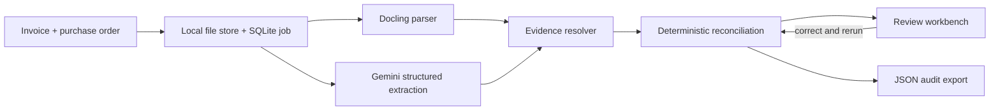

# ReconcileAI

Evidence-backed invoice and purchase-order reconciliation with Gemini, Docling, FastAPI, and deterministic financial controls.

ReconcileAI accepts an invoice and its purchase order, extracts typed fields from both documents, matches their line items, and reports quantity, price, currency, missing-item, and arithmetic discrepancies. Every supported finding links back to a page, source excerpt, and normalized bounding box. Reviewers can correct extracted records and rerun the controls without losing the original result.

> Status: public portfolio prototype. The 11-test deterministic suite and Docling ingestion path are verified locally. Live extraction requires your own Gemini API key. No model-quality claim is made until the versioned held-out evaluation is run and its report is committed.

## Demo flow

1. Upload an invoice and purchase order as PDF, PNG, or JPEG.
2. Docling parses text, tables, page numbers, and source geometry locally.
3. Gemini returns a schema-constrained extraction. Printed instructions are treated as untrusted document content.
4. ReconcileAI resolves evidence and runs decimal-based matching and arithmetic checks.
5. Click a finding to render its page with the source region highlighted.
6. Correct extracted JSON, rerun reconciliation, and export the auditable result.

## Architecture



The model extracts document meaning. Code owns matching, money arithmetic, validation, review state, and the final decision trail.

## Run locally

Python 3.12 is recommended.

```bash
git clone https://github.com/vi-nayKR/multimodal-document-intelligence.git
cd multimodal-document-intelligence
python3 -m venv .venv
.venv/bin/pip install -r requirements.txt
cp .env.example .env
# Add GEMINI_API_KEY to .env
./start_server.sh
```

Open `http://localhost:8000`. The first Docling run downloads its local parsing models.

Docker is also supported:

```bash
cp .env.example .env
docker compose up --build
```

Uploaded documents and the SQLite database live under `data/`, which is excluded from Git.

## API

| Endpoint | Behavior |
| --- | --- |
| `POST /api/v1/jobs` | Upload `invoice` and `purchase_order`; returns a persistent job ID. |
| `GET /api/v1/jobs/{job_id}` | Poll status and retrieve the typed result. |
| `PUT /api/v1/jobs/{job_id}/review` | Replace either reviewed extraction and rerun every control. |
| `GET /api/v1/jobs/{job_id}/export` | Download the current result and review history. |
| `GET /health` | Report service, model configuration, and API-key readiness. |

Interactive OpenAPI documentation is available at `/docs`.

## Evaluation

The repository includes a deterministic generator for 50 labeled invoice/PO pairs. Twenty development cases and thirty held-out cases use separate layout families. Scenarios cover clean matches, overcharges, quantity mismatches, and unexpected items.

```bash
.venv/bin/python scripts/generate_benchmark.py
GEMINI_API_KEY=... .venv/bin/python scripts/run_reconciliation_eval.py --split held_out
```

The live report records discrepancy precision, recall, F1, review rate, per-case latency, and case-level errors. Generated documents and unreviewed result files stay untracked so a published report must be an intentional, reproducible artifact.

For broader extraction analysis, [DocuBench](https://github.com/DocuPipe/DocuBench) provides difficult public documents and an open scorer. It is complementary to this paired reconciliation benchmark.

## Verification

```bash
.venv/bin/python -m pytest -q
.venv/bin/python scripts/generate_benchmark.py
```

The suite covers matching, overcharge impact, missing items, arithmetic failures, evidence resolution, persistence, and API contracts. Real-provider evaluation is kept out of CI to avoid nondeterministic cost.

## Limits

- Version 1 supports English documents, INR/USD-style monetary records, one invoice paired with one purchase order, and up to ten pages per document.
- Ambiguous descriptions and unsupported source fields are routed to review.
- Partial deliveries, complex discounts, tax-policy decisions, ERP writes, and payment execution are outside this version.
- The application is a review aid. A successful run means the implemented checks found no discrepancy; it is not an authorization to pay.

MIT licensed. Built by [Vinay K R](https://github.com/vi-nayKR).
