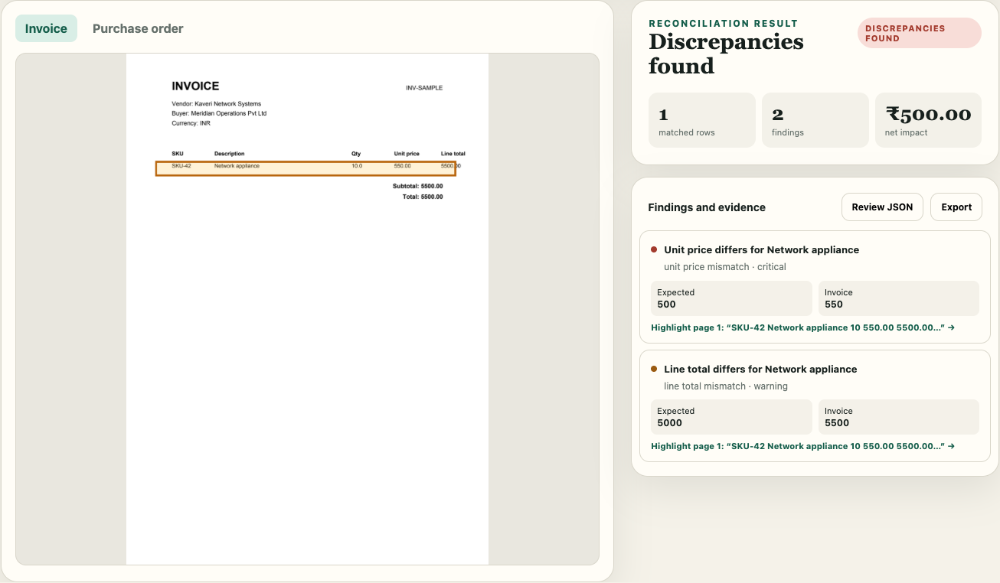
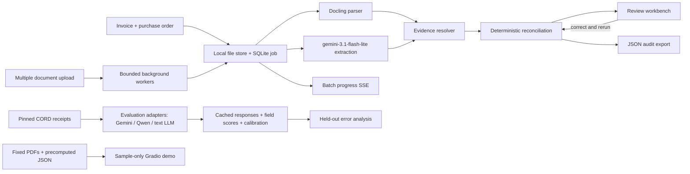

# ReconcileAI

Evidence-backed invoice and purchase-order reconciliation with gemini-3.1-flash-lite, Docling, FastAPI, and deterministic financial controls.

ReconcileAI accepts an invoice and its purchase order, extracts typed fields from both documents, matches their line items, and reports quantity, price, currency, missing-item, and arithmetic discrepancies. Every supported finding links back to a page, source excerpt, and normalized bounding box. Reviewers can correct extracted records and rerun the controls without losing the original result.

> Status: public portfolio prototype. The measured receipt comparison uses gemini-3.1-flash-lite and Groq qwen/qwen3.8-27b. Results distinguish live extraction from synthetic control fixtures. Spaces deployment is pending HF_TOKEN; the sample-only demo runs locally without keys.

## Results

| Rerunnable check | Recorded result | Evidence |
| --- | --- | --- |
| Frozen synthetic benchmark | 50 pairs; deterministic controls pass all fixture cases | [`verification.json`](results/verification.json), `python scripts/verify_results.py` |
| Public receipt benchmark preparation | 40 CORD receipts; 20 development / 20 held-out; 7 field types | [`dataset_inventory.json`](results/dataset_inventory.json), `python scripts/prepare_cord.py --limit 20` |
| Batch contract check with a stub extractor | 6 documents; 5 completed / 1 failed; at most 2 workers | [`verification.json`](results/verification.json), `python scripts/verify_results.py` |
| No-key sample | 2 flagged mismatches with PDF source evidence | [`verification.json`](results/verification.json), `python scripts/generate_sample.py` |
| Gemini 3.1 Flash-Lite (vision; `gemini-3.1-flash-lite`) | Held-out field F1 76.03%; review 100%; 20/20 completed | [Comparison](results/COMPARISON.md) |
| Qwen3.8-27B (Groq), `qwen/qwen3.8-27b` | Held-out field F1 65.96%; review 100%; 19/20 completed | [Comparison](results/COMPARISON.md) |
| Docling OCR + Gemini 3.1 Flash-Lite (`gemini-3.1-flash-lite`) | Held-out field F1 56.92%; review 85%; 20/20 completed | [Comparison](results/COMPARISON.md) |

Fixture checks exercise code using labeled or prerecorded extraction, not model perception. CORD preparation counts documents and labels; it does not measure extraction quality.

## Demo flow

For a no-key walkthrough, start the server and click **Open prerecorded sample**. It loads fictional PDFs and a frozen extraction result without calling Gemini or Docling. Click a finding to highlight its source, correct the extracted JSON, then export the review trail. Regenerate the fixture with `python scripts/generate_sample.py`. This sample demonstrates the UI and deterministic controls; it is not a model-quality measurement.



1. Upload an invoice and purchase order as PDF, PNG, or JPEG.
2. Docling parses text, tables, page numbers, and source geometry locally.
3. Gemini returns a schema-constrained extraction. Printed instructions are treated as untrusted document content.
4. ReconcileAI resolves evidence and runs decimal-based matching and arithmetic checks.
5. Click a finding to render its page with the source region highlighted.
6. Correct extracted JSON, rerun reconciliation, and export the auditable result.

## Architecture


```mermaid
flowchart LR
    Upload[Invoice + purchase order] --> Store[Local file store + SQLite job]
    Store --> Parse[Docling parser]
    Store --> Gemini[gemini-3.1-flash-lite extraction]
    Parse --> Ground[Evidence resolver]
    Gemini --> Ground
    Ground --> Rules[Deterministic reconciliation]
    Rules --> Review[Review workbench]
    Review -->|correct and rerun| Rules
    Rules --> Export[JSON audit export]
    Batch[Multiple document upload] --> Workers[Bounded background workers]
    Workers --> Store
    Store --> SSE[Batch progress SSE]
    CORD[Pinned CORD receipts] --> Compare[Evaluation adapters: Gemini / Qwen / text LLM]
    Compare --> Results[Cached responses + field scores + calibration]
    Results --> Analysis[Held-out error analysis]
    Sample[Fixed PDFs + precomputed JSON] --> Demo[Sample-only Gradio demo]
```

The model extracts document meaning. Code owns matching, money arithmetic, validation, review state, and the final decision trail.

## Run locally

Python 3.12 is recommended.

```bash
git clone https://github.com/vi-nayKR/multimodal-document-intelligence.git
cd multimodal-document-intelligence
python3 -m venv .venv
.venv/bin/pip install -r requirements.txt
cp .env.example .env
# Add GEMINI_API_KEY to .env
./start_server.sh
```

Open `http://localhost:8000`. The first Docling run downloads its local parsing models.

Docker is also supported:

```bash
cp .env.example .env
docker compose up --build
```

Uploaded documents and the SQLite database live under `data/`, which is excluded from Git.
Uploads are limited by `MAX_UPLOAD_SIZE_MB` per file and checked for a PDF, PNG, or JPEG signature before a job is created. This is an early rejection check, not a full document safety scan; keep this prototype local and remove `data/` when its files are no longer needed.
Gemini uses the OpenAI-compatible endpoint, a 60-second timeout (`GEMINI_TIMEOUT_MS`), a process-wide 15-second minimum call interval, and up to five exponential-backoff retries on HTTP 429 or transient 503. Timeouts are not retried. Public benchmark responses are cached before validation; rescoring is offline.

## API

| Endpoint | Behavior |
| --- | --- |
| `POST /api/v1/jobs` | Upload `invoice` and `purchase_order`; returns a persistent job ID. |
| `POST /api/v1/batches` | Upload repeated `documents` fields; returns an asynchronous batch job ID. |
| `GET /api/v1/batches/{batch_id}` | Read persisted per-document status, failures and extractions. |
| `GET /api/v1/batches/{batch_id}/events` | Receive SSE progress snapshots and a terminal `done` event. |
| `GET /api/v1/jobs/{job_id}` | Poll status and retrieve the typed result. |
| `PUT /api/v1/jobs/{job_id}/review` | Replace either reviewed extraction and rerun every control. |
| `GET /api/v1/jobs/{job_id}/export` | Download the current result and review history. |
| `GET /health` | Report service, model configuration, and API-key readiness. |

Interactive OpenAPI documentation is available at `/docs`.

Batch documents are independent invoice/receipt extractions; paired mismatch checks remain on `/jobs`. Workers are bounded per batch. Queued/processing jobs resume after restart; completed documents are preserved. SQLite and in-process background tasks suit a local prototype, not a distributed queue. Run one Uvicorn process to avoid duplicate restart recovery.

```bash
curl -F documents=@invoice-a.pdf -F documents=@invoice-b.pdf http://localhost:8000/api/v1/batches
curl -N http://localhost:8000/api/v1/batches/BATCH_ID/events
```

## Evaluation

The repository includes a deterministic generator for 50 labeled invoice/PO pairs. Twenty development cases and thirty held-out cases use separate layout families. Scenarios cover clean matches, overcharges, quantity mismatches, and unexpected items.

```bash
.venv/bin/python scripts/generate_benchmark.py
GEMINI_API_KEY=... .venv/bin/python scripts/run_reconciliation_eval.py --split held_out
```

The live report records discrepancy precision, recall, F1, review rate, per-case latency, and case-level errors. Generated documents and unreviewed result files stay untracked so a published report must be an intentional, reproducible artifact.

For broader extraction analysis, [DocuBench](https://github.com/DocuPipe/DocuBench) provides difficult public documents and an open scorer. It is complementary to this paired reconciliation benchmark.

### Real receipt comparison

CORD is licensed under [CC BY 4.0](https://github.com/clovaai/cord), attributed to Park et al. The dataset revision, source file checksums, selected images and labels are frozen in [`cord_manifest.json`](results/cord_manifest.json). Original images are downloaded locally and ignored by Git. Public CORD omits store identity labels; only annotated receipt fields are scored. Indonesian receipt layouts also probe behavior beyond the original English invoice scope. List-valued annotations are flattened while preserving duplicate occurrences; the scalar subtotal output cannot represent multiple annotated subtotal regions.

```bash
python -m pip install -r requirements-eval.txt
python scripts/prepare_cord.py --limit 20
# Configure GEMINI_API_KEY and VLM_API_KEY in your gitignored .env.
python scripts/run_real_eval.py --smoke
# Review results/SMOKE.md and smoke_comparison.json's full-run cost projection first.
python scripts/run_real_eval.py
# Recalculate scores, ECE, plots and review thresholds without OCR or API calls:
python scripts/run_real_eval.py --rescore real_comparison.json --target-review-rate 0.2
```

All adapters use the same extraction schema and evidence resolver. Explicit `null` invoice-number/vendor headers become empty abstentions and force human review; invalid money or line-item values still fail schema validation. Token costs remain recorded even when validation fails. Gemini receives the image and Docling text; Qwen receives the same inputs through Groq; the text-only baseline receives **only Docling text** using the same Gemini model. The exact Qwen model ID, catalog lookup date and prices are recorded in `results/provider_catalog.json`. Raw public-benchmark responses are cached locally under the gitignored `results/raw/`; parsed OCR caches are also ignored. Committed reports retain normalized field predictions, confidence, timing and usage summaries for offline rescoring. Dataset images and raw provider responses stay out of Git.

The runner reserves a conservative maximum cost before each call at paid-equivalent rates and persists spend accounting in `results/budget.json`, with a ceiling below $3. HTTP 429 and transient 503 use bounded retries with exponential backoff. Unknown costs stay unknown. The full run requires a successful smoke extraction for every backend and a known projection within budget. Interrupted requests retain their reservation; inspect billing before manually changing that ledger.

Reports include per-field precision/recall/F1, document review rate, latency percentiles and cost. Failed documents contribute missed fields. Timing covers completed documents' actual Docling conversion plus provider call wall time (including throttle/backoff), excluding budget preflight and scoring. Adapters share the same cached parse and its measured duration; cached responses preserve original generation time. Field comparison uses normalized value multisets per document, so it does not establish correct row association. Receipt scores do not replace the original paired discrepancy benchmark.

### Confidence and errors

Confidence is an evidence text-match heuristic, not an asserted probability. `CONFIDENCE_THRESHOLD` now flags weak source support in the shared resolver; missing required evidence always triggers review. Field correctness and the document routing score receive separate reliability plots and ECE calculations. Thresholds are fitted on development data only, then assessed on held-out receipts for review rate, error-detection precision/recall and accepted-document accuracy. Equal scores are kept together; the requested review rate may be unattainable. The runner records a proposed threshold without silently changing production configuration.

[`ERROR_ANALYSIS.md`](ERROR_ANALYSIS.md) records held-out examples. Layout/OCR/reasoning attribution is marked as a diagnostic hypothesis until visually adjudicated; schema failures and infrastructure failures remain distinct. Selected visual adjudications are committed in `results/error_review.json`. The list-valued subtotal preparation correction keeps the prior manifest and hash; affected judge diagnoses are marked stale. No error distribution or calibration result is invented when a provider has not run.

## Sample-only Gradio demo and Spaces

```bash
python -m pip install -r requirements-demo.txt
python scripts/generate_sample.py
python demo_app.py
# Open http://localhost:7860
# Configure HF_TOKEN locally, then publish the explicit sample-only allowlist:
python scripts/deploy_space.py
```

The standalone demo accepts no uploads and imports no provider code. Viewers need no keys. It shows original fictional PDFs, extracted fields, source bounding boxes and flagged mismatches from precomputed JSON. Field boxes are derived from the sample PDF's actual text geometry. The deployment script uploads only the demo entrypoint, minimal dependencies, Space README and fixed sample assets; `.env`, credentials, user uploads and API extraction code are excluded. A Space URL is recorded after upload, and public readiness must be checked before claiming deployment.

## Verification

```bash
.venv/bin/python -m pytest -q
.venv/bin/python scripts/generate_benchmark.py
python scripts/verify_results.py
# Optional: actually parse a PDF and a CORD receipt with Docling (downloads local models):
python scripts/verify_results.py --with-docling
```

The suite covers matching, overcharge impact, missing items, arithmetic failures, evidence resolution, persistence, upload rejection/cleanup, and API contracts. Real-provider evaluation is kept out of CI to avoid nondeterministic cost.

## Limits

- Version 1 supports English documents, INR/USD-style monetary records, one invoice paired with one purchase order, and up to ten pages per document.
- Ambiguous descriptions and unsupported source fields are routed to review.
- Partial deliveries, complex discounts, tax-policy decisions, ERP writes, and payment execution are outside this version.
- The application is a review aid. A successful run means the implemented checks found no discrepancy; it is not an authorization to pay.

MIT licensed. Built by [Vinay K R](https://github.com/vi-nayKR).

### Gemini configuration and diagnostic judge

Set `GEMINI_API_KEY` in the gitignored project `.env`; `.env.example` lists the settings. Extraction and diagnostic judging now both use `gemini-3.1-flash-lite`, temperature 0. Google's authenticated model API successfully returned this exact model ID on 2026-10-06. The user authorized a cheaper replacement after `gemini-2.5-flash` and `gemini-2.5-flash-lite` returned HTTP 404 for the replacement key. [Published pricing](https://ai.google.dev/gemini-api/docs/pricing) is $0.25 per million input tokens and $1.50 per million output tokens. Model choice and access history are recorded in `results/model_selection.json` and `results/raw/model_probe/`.

`GEMINI_BASE_URL=https://generativelanguage.googleapis.com/v1beta/openai/`, `DEFAULT_VISION_MODEL`, `GEMINI_JUDGE_MODEL`, `GEMINI_JUDGE_ENABLED=true`, `GEMINI_FREE_TIER`, `GEMINI_MIN_INTERVAL_SECONDS`, and `GEMINI_MAX_RETRIES` control the adapter. The smoke used a thirty-second minimum interval; the full run uses fifteen seconds, with at most five retries. Short-term HTTP 429 and transient 503 receive bounded exponential backoff; provider daily-quota hints are cached until expiry. Credential fingerprints isolate quota state when projects change. Successful raw responses and actual Docling OCR are cached, and metric rescoring is offline.

The shared under-$3 ledger reserves a conservative upper bound before each call and settles using returned token counts at published rates, **even when the key is declared free**. Tables distinguish configured free-tier cost from paid-equivalent token cost. These are estimates, not billing invoices; missing usage remains unknown.

Run `python scripts/run_real_eval.py --smoke` first (five documents per configured backend), inspect `results/SMOKE.md` and its paid-equivalent projection, then run without `--smoke` for the full prepared split. Recompute HTTP counters from local ignored attempt caches with `python scripts/summarize_api_usage.py`; committed summaries record the cache hashes. The Groq Qwen comparison uses `VLM_API_KEY`; Spaces deployment still needs `HF_TOKEN`.

### Limitations

**Same-model judge:** extraction and diagnostic judging use the identical Flash-Lite model, so diagnoses may share or prefer the extractor's errors. Backend identity is blinded. Judging does not generate field F1 or change label-based scoring; its error categories are hypotheses requiring visual review.

The earlier Pro judge repeatedly returned HTTP 429; its authorized 2.5 Flash fallback was subsequently unavailable. The earlier 3.8 Flash attempt also hit an exhausted twenty-call daily allowance, with no successful extraction. Those failed attempts remain in sanitized trace history and are excluded from model-quality claims. The replacement model's measurements are reported separately. CORD annotations can omit visible amounts; predictions absent from its labels remain false positives. Selected visual reviews identify possible annotation gaps without changing the frozen scores.

### Groq VLM setup and page limit

The Qwen comparison now uses `VLM_BASE_URL=https://api.groq.com/openai/v1`, `VLM_MODEL=qwen/qwen3.8-27b`, and `VLM_API_KEY`. Both `VLM_INPUT_USD_PER_M_TOKEN=0.80` and `VLM_OUTPUT_USD_PER_M_TOKEN=4.00` load directly from the project `.env` through Settings and are recorded as configured cost rates. `results/provider_catalog.json` stores the provider, endpoint, exact model ID, lookup date, context bound, and effective prices. Catalogue validation accepts nested or flat input modalities and leaves absent capabilities unverified until the image smoke test.

Groq permits **three images per request**. The adapter renders every page of a PDF with up to three pages and rejects longer PDFs before calling the provider; split those PDFs first. It also checks the documented twenty-megabyte request limit. There is no silent page truncation. The CORD benchmark uses single receipt images, so the page limit does not affect it. [Groq vision documentation](https://console.groq.com/docs/vision).

Run `python scripts/run_real_eval.py --smoke` for all three configured backends before the full comparison. Raw cache keys include the endpoint and model, so OpenRouter responses cannot be reused as Groq results.
