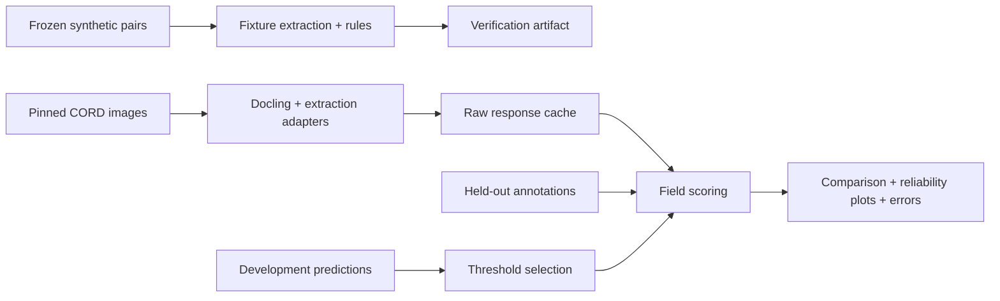

# ReconcileAI evaluation

## Results

| Check | Result | Rerun |
| --- | --- | --- |
| Synthetic control fixtures | 50 pairs preserved; all cases pass deterministic reconciliation | `python scripts/verify_results.py` |
| Real receipt dataset | 40 CORD receipts; 7 field types; official validation/test splits remain separate | `python scripts/prepare_cord.py --limit 20` |
| Model comparison and calibration | Configured Gemini + Groq; see [smoke](../results/SMOKE.md) and [comparison](../results/COMPARISON.md) | `python scripts/run_real_eval.py --smoke` |

The numeric evidence lives in [`results/verification.json`](../results/verification.json) and [`results/dataset_inventory.json`](../results/dataset_inventory.json). Fixture success and label counts are not extraction-quality measurements.



## Real-data workflow

Install `requirements-eval.txt`, prepare CORD, configure credentials in `.env`, run the five-document smoke comparison, review its cost projection, then run the full comparison. Use `--rescore real_comparison.json` for offline recalculation. Never use CORD ground-truth OCR text as input to a provider. Labels stay in the scorer; every adapter receives actual Docling output. See the root [README](../README.md) for costs, calibration and scoring limits.

The benchmark is generated locally so every document and label is reproducible. The committed `benchmark_v1.1.0_manifest.json` freezes case IDs, splits, scenarios, and labels; the live runner rejects a changed generated manifest.

```bash
python scripts/generate_benchmark.py
python scripts/run_reconciliation_eval.py --split held_out
```

The generator creates 50 invoice/purchase-order pairs: 20 development cases and 30 held-out cases. Held-out cases use different layouts. Generated PDFs live under `evals/generated/` and are ignored; `manifest.json` records ground truth and seeds.

The live runner requires `GEMINI_API_KEY` and stays separate from deterministic CI. Benchmark version 1.1.0 retains the same split and scenarios and adds row-value and expected row-position labels. The report records duplicate discrepancy types as counts, exact extracted row values, evidence row placement, failures, review rate, latency, provider metadata, dataset hash, and commit. Discrepancy scoring still compares types without identifying which row caused each finding, and the documents are synthetic and simple. Quality rates cover completed cases only; failed cases are counted separately. The live paired synthetic run remains separate; receipt extraction results are in `results/real_comparison.json`.

| Measured backend | Held-out field F1 | Review rate |
| --- | --- | --- |
| Gemini 3.1 Flash-Lite (vision; `gemini-3.1-flash-lite`) | 76.03% | 100% |
| Qwen3.8-27B (Groq), `qwen/qwen3.8-27b` | 65.96% | 100% |
| Docling OCR + Gemini 3.1 Flash-Lite (`gemini-3.1-flash-lite`) | 56.92% | 85% |
