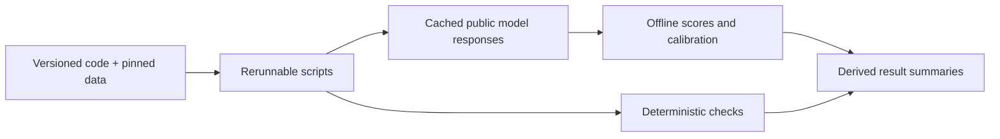

# Reproducible results

| Artifact | What it establishes | Rerun |
| --- | --- | --- |
| `verification.json` | Frozen synthetic control fixtures, test contracts and fictional sample findings | `python scripts/verify_results.py` |
| `cord_manifest.json`, `dataset_inventory.json` | Pinned public receipt selection and field labels | `python scripts/prepare_cord.py --limit 20` |
| `provider_catalog.json` | Exact configured VLM provider/model, lookup date and published rates | `python scripts/run_real_eval.py --smoke` |
| `smoke_comparison.json`, `SMOKE.md` | Small live comparison and full-run cost projection, when credentials exist | `python scripts/run_real_eval.py --smoke` |
| `real_comparison.json`, `COMPARISON.md` | Live quality/latency/cost/calibration, or explicit provider unavailability | `python scripts/run_real_eval.py` |
| `ingestion.json` | Actual Docling parsing of a PDF and a public receipt; no model-quality claim | `python scripts/verify_results.py --with-docling` |

No provider has completed a live extraction until its report includes measured rows. Missing credentials, unknown cost and failed extraction are distinct states. Fixture/control success does not measure perception quality. Reliability plots are generated from real predictions only; no illustrative plot is presented as an experimental result.

Raw responses, attempt sidecars and parsed OCR are kept only in gitignored local caches. Committed summaries retain normalized predictions and measured metadata, without full provider responses or OCR text. `.env` and private uploaded documents are excluded. Offline rescoring uses the committed normalized predictions and original latency records without contacting a provider. HTTP-counter regeneration needs the local ignored attempt caches; `rate_limiting.json` records their hashes.

The dataset is CORD by Park et al., licensed under [CC BY 4.0](https://github.com/clovaai/cord). `cord_manifest.json` records attribution, revision and image hashes. Numbers used in resume bullets must reference these committed artifacts and retain the distinction between dataset preparation, fixture checks and live measurements.

The successful smoke completed all three backends on five receipts each. Earlier quota and access failures remain in `model_access.json`, `judge_fallback.json`, and `rate_limiting.json` as history; they are excluded from quality scores. `raw/*.attempts.json` sidecars preserve sanitized HTTP statuses and retry delays, including aborted attempts; `parsed/` preserves actual Docling OCR for reuse. These logs exclude direct access diagnostics. Rerun the HTTP counters with `python scripts/summarize_api_usage.py`.

The corrected CORD adapter flattens list-valued annotations while preserving duplicate occurrences. `cord_manifest_before_list_fix.json` preserves the earlier preparation. The report records the transition; model images and predictions are unchanged. To replay that verified structural migration on an older report, use `--rescore real_comparison.json --previous-manifest cord_manifest_before_list_fix.json`. Other label or image changes are rejected. Current reports need only `--rescore real_comparison.json`.

| Measured backend | Held-out field F1 | Review rate |
| --- | --- | --- |
| Gemini 3.1 Flash-Lite (vision; `gemini-3.1-flash-lite`) | 76.03% | 100% |
| Qwen3.8-27B (Groq), `qwen/qwen3.8-27b` | 65.96% | 100% |
| Docling OCR + Gemini 3.1 Flash-Lite (`gemini-3.1-flash-lite`) | 56.92% | 85% |
